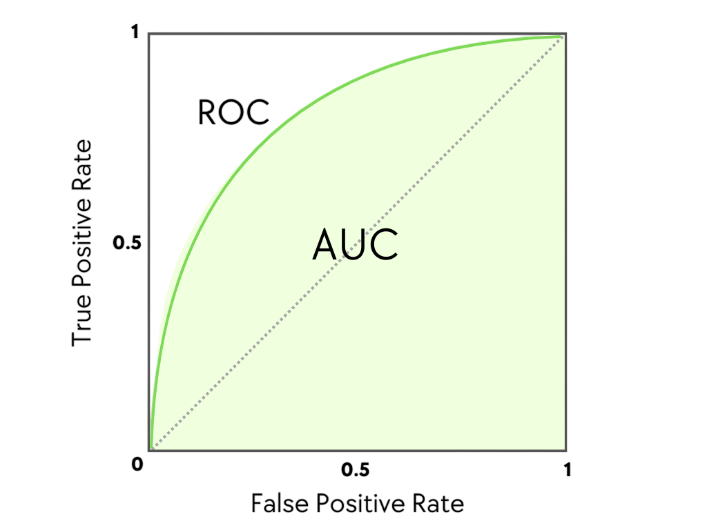

::: {.callout-tip icon="false"}
## Github Repo Link

[Ellie's Github](https://github.com/stat301-3-2026-spring/l01-review-epanko.git)
:::

## Overview

The goal of this lab is to review machine learning/predictive modeling vocabulary and concepts covered in Data Science 2 with R (STAT 301-2).

### Question 1

Provide a brief outline/overview of the steps involved in a supervised machine learning process. Could provide this as a bulleted list. 

::: {.callout-tip icon="false"}
## Solution

- Perform an EDA on the data and clean the dataset before the modeling process.

- You then inspect the target variable to ensure that the split is not overly unbalanced or that the target variable is skewed. If you find that the target variable is unbalanced or skewed, you can then fix it right there and then or in steps in your recipe. 

- You then split the data into a training and test dataset stratifying for the target variable.

- You can then split the data on folds using resampling.

- You then make the recipe for the model including variations for tree models if needed. You also prep and bake the recipe to look for errors and ensure that the recipe will run.

- You then tune and fit the models. You can start by fitting a baseline model. For models with tuning parameters, you make the tuning grid and set ranges for the tuning parameters. After you set the tuning grid, you can fit the models on the folds or training data.

- You then analyze the models on the appropriate performance metric and analyse the tuning performance. You then pick the best model based on performance.

- You then take the best model and train and fit it to the full training data set.

- You then analyse the final model and make predictions testing the model on the testing data. You then use this information to evaluate the model's performance.

:::

### Question 2

Explain the difference between supervised and unsupervised learning.

::: {.callout-tip icon="false"}
## Solution

The difference between supervised and unsupervised learning is whether you have a target variable. 

- In unsupervised you do not have a target variable you just have a lot of variables and want to know information from the data as a whole. You do not have a target variable that supervises the data. The key of unsupervised learning is identifying patterns and relationships in the data overall across many variables, not just looking at the effect on a target variable.

- In supervised learning you are supervising the data using outcome variables. Instead of looking at relationships generally, the algorithms are trained to specifically look at relationships with the target variable. In supervised learning you have a reason for picking a specific model because you can see how it performs when predicting the target variables.

:::

### Question 3 

In general, we can classify a model by its purpose into 1 of the 3 categories below. Provide a brief description of the goals of these model classes.

#### Descriptive Models 

::: {.callout-tip icon="false"}
## Solution

- A descriptive models main goal is trying to understand the data. Descriptive models investigate patterns and trends in the data and explain what is happening in the data. They could be used to show if relationships are linear or non linear. These models describe relationships in the data through modeling. For descriptive models, linear models are used a lot. Parametric models are also used a lot in descriptive models. The data can be summarized into a single value in  descriptive models.

:::

#### Inferential Models

::: {.callout-tip icon="false"}
## Solution

The goal of inferential models is to explain the how and the why of a relationship. Inferential models want to infer if a variable in a dataset is statistically related to a target variable. In inferential models, the goal is to see if the relationship seen can be generalized or point to a causal relationship. Inferential models want to understand relationships. The models want to know what inputs effect the outcome variable. Parametric models are good for differential models. 

:::

#### Predictive Models

::: {.callout-tip icon="false"}
## Solution

The goal of predictive models is to predict our target variable the best we can. In predictive models, we do not care how we make the prediction. The goal is not to make a theory for why when we put these things in they make the best model, it is just to make the model that produces the best prediction. In these models, we just put the variables in to try and get the best model. This model is good for when we just need a good prediction and we don't care how we get the prediction. 

:::

### Question 4 

We can further describe/classify predictive models by how they were derived or developed as being either mechanistic or empirically driven. 

#### Part (a)

What does it mean to be a mechanistic model?

::: {.callout-tip icon="false"}
## Solution

Mechanistic models are models that are driven by fundamental knowledge such as key mathematical theorems. Mechanistic models are models that are explainable by science and math. The models are made using assumptions based off of science, math, and underlying principals, not directly made using the data. These models are parametrically informed. Since these models are math and science based, they require less data to make a good prediction. 

:::

#### Part (b)

What does it mean to be an empirically driven model?

::: {.callout-tip icon="false"}
## Solution

Empirically driven models are data driven models. These models are more flexible models as they adhere to the data not a formula. These models do not rely on assumptions, they let the data make the choices. These models are made directly using real world observed data, not math principals. 

:::

#### Part (c)

How does the mechanistic and empirically driven model terminology relate to the parametric and nonparametric model terminology? 

::: {.callout-tip icon="false"}
## Solution

- Mechanistic models are typically parametric models because the models use math and science principals to make predictions. The models are often more fixed models, or models that use fixed equations and physics theorems to make predictions. Fixed models are parametric models that are fixed to a constant value or an equation, so, most mechanistic models are parametric models. Both models used "fixed" or "mathematical" to describe their methods.

- Empirical models are typically nonparametric models because both empirical models and nonparametric models are data driven models. These models both do not make assumptions about the data as the models are shaped by the observations themselves. Both models use the termonology "data driven" to describe their methods.

:::

#### Part (d)

In general, is a mechanistic or empirically driven model easier to interpret? Explain.

::: {.callout-tip icon="false"}
## Solution

Mechanistic models are generally easier to interpret as they are based in known fixed principals. The models are generally made using known formulas, making it easier to interpret the results as the formula is the same every time and means the same thing every time. 

An empirically driven model is more difficult to interpret because it is made directly using the data. An empirical model will be interpreted differently every time depending on what are data is and what are target variable is, making it more difficult.

:::

#### Part (e)

How does mechanistic and empirically driven model terminology relate to the idea of model flexibility? That is, which would be more or less flexible than the other.

::: {.callout-tip icon="false"}
## Solution

Mechanistic models are less flexible and more fixed than empirically driven models. Mechanistic models use formulas and underlying principals to make their predictions, so, the model is fixed to the equation and will only make predictions in one way. On the other hand, the empirically driven model is data driven and will make predictions differently each time, depending on the data itself. This makes it the more flexible model.

:::

#### Part (f)

Describe the bias-variance trade-off when considering the use of a mechanistic or empirically driven model. 

::: {.callout-tip icon="false"}
## Solution

Mechanistic models are at a risk of underfitting to the data because they have a trade-off of high bias and low variance. They are biased because the data will be fit to whatever equation the mechanistic model is using but it will have low variance because it is using the same mechanism each time. Since the data is fit to the equation, it may not capture the real life trend.

Empirically driven models are prone to overfitting, showing the other side of the trade-off. They are low bias but high variance. They are low biased because the model is made directly from the data so it is not biased to its method. It does have a lot of variance, however, because the model is fit to the data. This leads to a fear of overfitting the model to the data.

:::

### Question 5 

Explain the difference between a regression and classification machine learning (ML) problems.

::: {.callout-tip icon="false"}
## Solution
A regression machine learning problem is a problem that deals with a target variable that is continuous and numerical. When making our models, we are predicting a numerical value and our predictions can be any number that the value could take. An example of this problem would be predicting house prices based on factors. 

A classification machine learning problem is a problem that deals with a target variable that is categorical and has set levels. When making our models, we are predicting which class in our target variable the observation will be. An example of this problem could be predicting if a patient will or will not get COVID based on factors.

:::

### Question 6 

When splitting the data, why is it useful to stratify by the outcome/target variable? 

::: {.callout-tip icon="false"}
## Solution

When splitting the data, it is useful to stratify by the outcome or target variable to ensure that the variable is being properly represented in each split. When we stratify the data by the target variable, we ensure that each split has the same proportion of the target variable as the original dataset. This is important to ensuring that both our test data and training data are good representations of our original data and can be used to make predictions for the target variable. If the test and train datasets do not maintain the same split, we may be unable to make a model that will be accurate for our target variable and it will not be accurate with new data.  

:::

### Question 7 

Briefly describe how v-fold cross validation with repeats is used to estimate test RMSE. Also provide an explanation of why we use it. 

::: {.callout-tip icon="false"}
## Solution

V-fold cross validation is used to battle overfitting. It works by splitting your data into v equal folds where on each fold, the model is trained on v-1 folds, leaving one fold for assessment and evaluation. The RMSE performance is averaged across the folds to give one estimate. This process is then repeated however many times we specify and the averaged RMSE value from each repeat is put together and averaged to get the final test RMSE estimate of the model.

We use v-fold cross validation to get a better estimate that actually represents our data. The more spits we do of our data the less chance we have that our model will be over fit to the training data. It also stabilizes the estimate as we are averaging across the folds. The v-fold cross validation gives a better estimate to how our models will actually perform on new data.

:::

### Question 8

When might we use a bootstrap resampling procedure instead of v-fold cross validation to estimate test RMSE?

::: {.callout-tip icon="false"}
## Solution

We would use a bootstrap resampling procedure to estimate test RMSE when data is smaller and we have folding issues. With very small sample sizes, it is hard to split the data into folds, as there are few observations. With little data to split, the folds could become biased representations of the data, holding unbalanced variables. In this situation, it would be better and more accurate to estimate test RMSE using bootstrap resampling. 

:::

### Question 9 

Briefly describe model tuning and why we use it.

::: {.callout-tip icon="false"}
## Solution

Model tuning is adjusting and choosing the best hyperparameters to create models that are reasonably able to be run with the best accuracy. We tune models by defining a hyperparameter range and training our model on the tuning grid. The model will then be trained and evaluated on each hyperparameter combination within our tuning grid. We then pick the model with the tuning parameter combination that performed the best on our performance metric. 

We use tuning to improve the performance of our models, as tuning allows us to fit the model more directly to the data in our dataset. It is unlikely that the default settings work best for our data, so tuning these settings will improve our models. We also use tuning to make better comparisons between models. To fairly compare our models, it is best if the models are made using the best settings possible so we know we are comparing the best version of each model. If we just use the default settings, differences between model performance could just be that the default for one model worked better for our data than the default for a different model.The better performing model may just have good default values and not be the best model type for our data.

:::

### Question 10 

What are two common performance metrics when dealing with a regression ML problem?

::: {.callout-tip icon="false"}
## Solution

The two common performance metrics for a regression problem are mean absolute error or MAE and root mean squared error or RMSE. 

MAE is the average amount of error between the predicted values and the actual values. A lower MAE is better. The best score would be 0 because that would mean the average difference between the predicted values and the actual values would be 0.

RMSE is the average difference between predicted values and the actual values.  A lower score is better because a lower score would mean a lower difference. The best score would be 0.

:::

What are two common performance metrics when dealing with a classification ML problem?

::: {.callout-tip icon="false"}
## Solution

The two common performance metrics when dealing with a classification problem are accuracy and ROC AUC. Accuracy is the proportion of correct predictions out of the total predictions made. For accuracy, a higher score is better because a high score means that a higher percentage of our predictions were correct. 

ROC AUC is the receiver operating characteristic area under the curve. On a graph, the ROC AUC would be the space in between the line representing our predictions and the line representing the actual values. It can be interpreted as representing the probability that our model ranks a randomly chosen positive case higher than a randomly chosen negative one. Basically the probability that our model will sort an observation that is a yes case to be closer to the yes pile, thus predicting yes, than the no pile. You want a higher ROC AUC as the closer the value is to 1, the more perfect the correlation is between our predicted line and the actual value line. The picture below from [ACTE Technologies](https://www.acte.in/what-is-roc-curve-in-machine-learning) shows this curve and area well. If the curve reached the 1 value on the y axis, the true positive rate would be 100, meaning every prediction would be correct. 

:::

### Question 11

Classify each question/problem below as either prediction or inferential. Explain your reasoning for each.

A company with a subscription based service (for example Netflix, Disney+, New York Times, etc) has data concerning customer interactions with a them, including features like the number of customer service calls, quality of service calls, subscription length, engagement with the service, discounted service, etc. They are interested in two questions:

1. Does a high number of service calls impact a customer's likelihood of churn in the next month (leave the company/drop the service)?

::: {.callout-tip icon="false"}
## Solution

I think this problem is mostly inferential, but it could be seen as having a predictive part. This question is directly asking about the relationship between two variables. It is asking about the relationship between a high number of service calls and churn. It is explaining why the churn happens not just if the churn will happen or not. That is what makes it an inferential problem. It could be seen of as predictive because is is asking about the impact of next months churn, but it is inferential because we are not predicting churn, we are making an inference about churn based off of the number of service calls. We are looking at the impact not predicting an outcome, thus making the problem inferential.

:::

2. How likely is it that a customer will churn in the next month (leave the company/drop the service)?

::: {.callout-tip icon="false"}
## Solution

This problem would be a prediction problem because they are looking to predict how likely a customer is going to drop the service in the next month. They are not just showing which relationships are important to whether the customer dropped the service, they are predicting if in the future they will drop the service. The problem is not asking why the customer will churn in the next month or what factors relate to churn, it is simply predicting if they churn or not. Since the question is just asking to predict an outcome, it is a predictive problem.

:::

